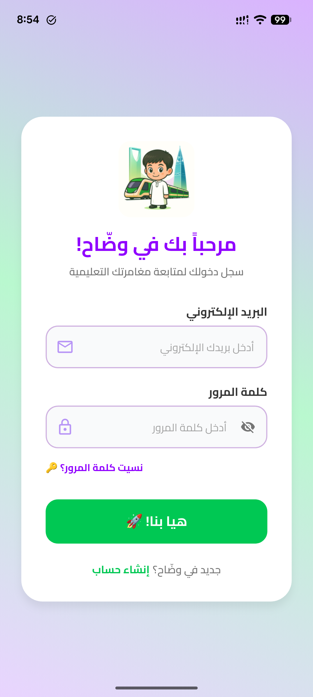
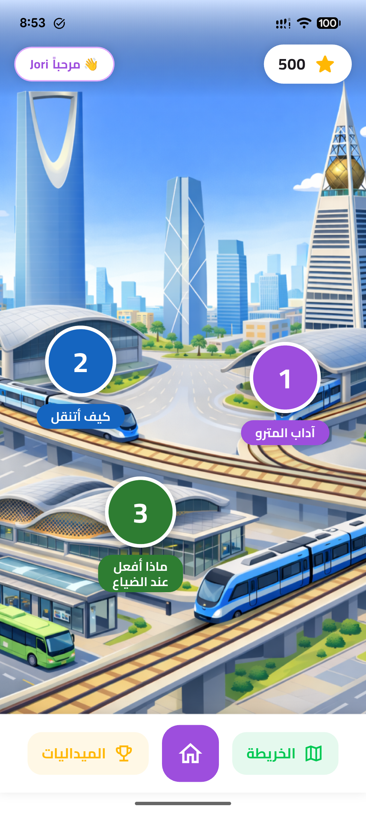
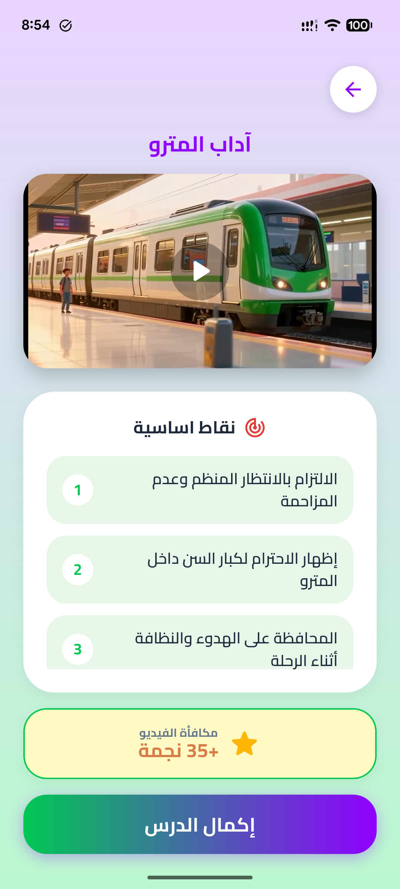
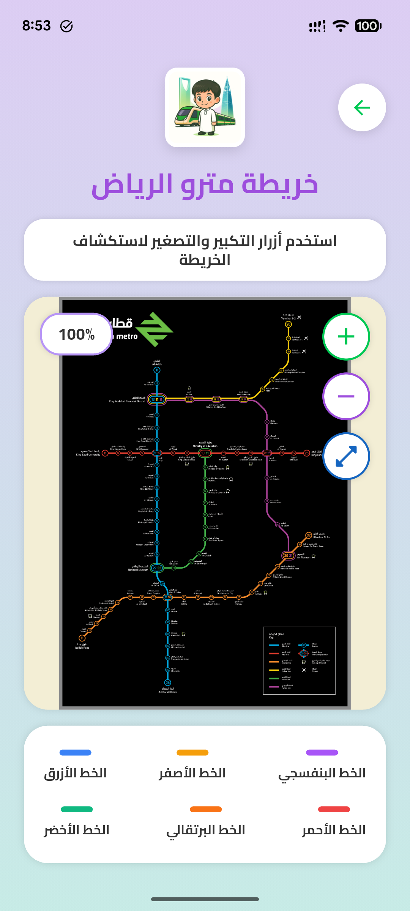
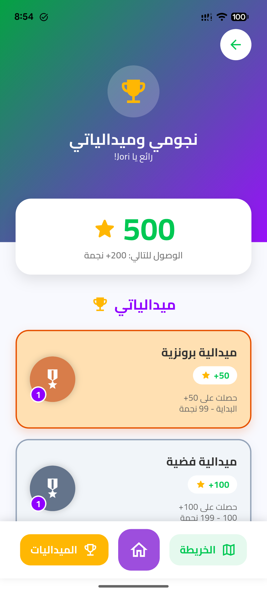
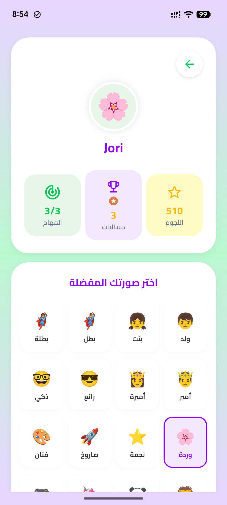

# Waddah (وضّاح) — Arabic Educational App

Waddah is a gamified, Arabic-first educational mobile app that teaches children proper public-transit etiquette and life skills through interactive lessons, quizzes, video content, and a Unity-powered AR experience. The app is built primarily around the Riyadh Metro and uses an RPG-style node map where kids unlock lessons by completing the previous one.

## Purpose

The app aims to make learning real-world skills fun and culturally relevant for Arabic-speaking children. Each "node" on the map represents a lesson (e.g. *Metro Etiquette*, *How to Navigate*, *What to Do During Noise*), and learners earn stars and medals as they progress. After completing a quiz, an AR mini-game launched via a Unity scene reinforces what they learned.

## Screens

<table>
  <tr>
    <td align="center">
      <br/>
      <b>Login</b><br/>
      <sub>FirebaseAuth, RTL Arabic, gradient background</sub>
    </td>
    <td align="center">
      <br/>
      <b>Main Map Dashboard</b><br/>
      <sub>RPG-style lesson nodes over a Riyadh skyline</sub>
    </td>
    <td align="center">
      <br/>
      <b>Lesson</b><br/>
      <sub>Embedded video + key points + star reward</sub>
    </td>
  </tr>
  <tr>
    <td align="center">
      <br/>
      <b>Riyadh Metro Map</b><br/>
      <sub>Interactive zoomable colour-coded lines</sub>
    </td>
    <td align="center">
      <br/>
      <b>Stars & Medals</b><br/>
      <sub>Bronze, silver, and higher tiers based on stars</sub>
    </td>
    <td align="center">
      <br/>
      <b>Profile / Avatar</b><br/>
      <sub>Pick an avatar, see nodes/medals/stars progress</sub>
    </td>
  </tr>
</table>

### Unity AR Mini-Game
After a quiz, the AR game card unlocks. Tapping it launches a fullscreen Unity scene (Vuforia-based) with augmented-reality interactions tied to the lesson content.

## Tech Stack

- **Frontend:** Flutter (Dart) — full RTL Arabic, `Cairo` font from Google Fonts
- **Auth & Backend:** Firebase Auth, Firebase Firestore
- **AR / 3D:** Unity 2022.3.62f1 with Vuforia, embedded via `flutter_unity_widget`
  - Android: full-screen `OverrideUnityActivity` launched via `MethodChannel`
  - iOS: `UnityFramework.framework` embedded into the Flutter Runner, launched via `MethodChannel` using `UnityFramework.getInstance().runEmbedded(...)`
- **Video:** `video_player` for in-lesson video playback
- **Permissions:** `permission_handler` (camera permission for AR)

## Project Structure

```
waddah/
├── lib/
│   ├── main.dart
│   └── screens/
│       ├── login_screen.dart
│       ├── signup_screen.dart
│       ├── forgot_password_screen.dart
│       ├── main_dashboard.dart        # RPG-style map of lesson nodes
│       ├── node_progress_screen.dart
│       ├── lesson_videos_screen.dart
│       ├── video_player_screen.dart
│       ├── quiz_screen.dart
│       ├── game_screen.dart           # Launches Unity AR
│       ├── map_viewer_screen.dart     # Riyadh Metro interactive map
│       ├── progress_screen.dart       # Medals & stars
│       ├── profile_screen.dart
│       ├── personal_info_screen.dart
│       └── feedback_screen.dart
├── android/                           # Android-specific (includes unityLibrary module)
├── ios/                               # iOS-specific (includes UnityFramework.framework + Data)
├── unityLibrary/                      # Unity Android export
└── images/                            # Screenshots for this README
```

## Setup

### Prerequisites

| Tool | Version |
|------|---------|
| Flutter SDK | 3.41.x stable |
| CocoaPods | 1.16.x (iOS only) |
| Xcode | 16+ (iOS only) |
| Android Studio + SDK | for Android |
| Apple Developer signing | for installing on a physical iPhone |

### 1. Install Flutter SDK
https://docs.flutter.dev/get-started/install

```bash
flutter --version
```

### 2. Install Dependencies
```bash
cd waddah
flutter pub get
```

### 3. Android — Accept Licenses
```bash
flutter doctor --android-licenses
```
Type `y` for every prompt.

### 4. iOS — Install CocoaPods
```bash
brew install cocoapods
```

### 5. iOS — Patch `flutter_unity_widget`
The plugin's iOS code expects properties that aren't in the current Unity export. Apply this patch once after every `flutter pub get`:

```bash
python3 -c "
path = '$HOME/.pub-cache/hosted/pub.dev/flutter_unity_widget-2022.2.1/ios/Classes/UnityPlayerUtils.swift'
content = open(path).read()
old = '''            controller?.unityMessageHandler = self.unityMessageHandlers
            controller?.unitySceneLoadedHandler = self.unitySceneLoadedHandlers'''
new = '''            if controller?.responds(to: Selector((\"unityMessageHandler\"))) == true {
                controller?.setValue(self.unityMessageHandlers, forKey: \"unityMessageHandler\")
            }
            if controller?.responds(to: Selector((\"unitySceneLoadedHandler\"))) == true {
                controller?.setValue(self.unitySceneLoadedHandlers, forKey: \"unitySceneLoadedHandler\")
            }'''
if old in content:
    open(path, 'w').write(content.replace(old, new))
    print('Patched OK')
else:
    print('Already patched')
"
```

### 6. iOS — Set Signing Team
```bash
open ios/Runner.xcworkspace
```
In Xcode: select **Runner** target → **Signing & Capabilities** → check **Automatically manage signing** → pick your Apple ID team. Close Xcode.

### 7. Verify
```bash
flutter doctor
```

### 8. Run
```bash
# Android
flutter run -d <android-device-id>

# iOS
flutter run -d <iphone-device-id>
```

## Unity AR Setup Notes

The Unity scenes are built separately (Unity 2022.3.62f1 + Vuforia + IL2CPP) and exported per platform:

- **Android:** Unity exports a Gradle module → already integrated as `unityLibrary/`. The native `libil2cpp.so` ARM64 binary lives in `unityLibrary/src/main/jniLibs/arm64-v8a/`.
- **iOS:** Unity exports an Xcode project → built into `UnityFramework.framework` on a Mac, then embedded into `ios/UnityFramework.framework`. Game data lives in `ios/Data/`.

Both platforms launch the Unity scene full-screen via a `MethodChannel('com.capstone.waddah/unity')`. See `lib/screens/game_screen.dart`.

## Roadmap

- More lesson nodes and AR scenes for different transit scenarios
- Leaderboards and social features
- Parent dashboard for tracking child progress
- Offline mode for lessons (video caching)
